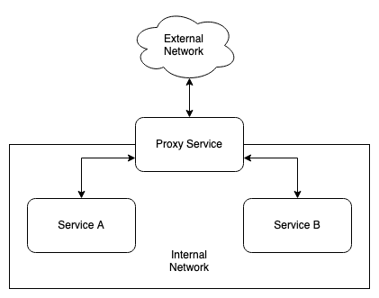

# LaraReact Serve

Nginx Proxy Laravel (With FrankenPHP) React docker containerization



## Requirements
Docker ^27 + Compose Plugin

## Installation

Setup services and configure the .env variables and domains.

```bash
cp .env.example .env
```

## SSL

Please create ssl key & cert files for each services in the path of ./docker/proxy/ssl.
Also make sure that there are correct keys and certs like : app.local.crt and app.local.key

[LetsEncrypt](https://letsencrypt.org/) is a free option for production environment.

## Local SSl

If you wish to serve ssl locally you have 2 options:

### Mkcert

Install mkcert in your machine and do the following:

```bash
mkcert -install
cd ./scripts/proxy

bash mkcert.sh YOUR_DOMAIN
```

### Manual OpenSSL

Setup OpenSSL in your machine and config the key & cert files, you can use the ./script/opensslgen.sh after configuring your ssl key & pem files in that directory.

[Read this article](https://deliciousbrains.com/ssl-certificate-authority-for-local-https-development/)

## Serve
```bash
docker compose up -d
```